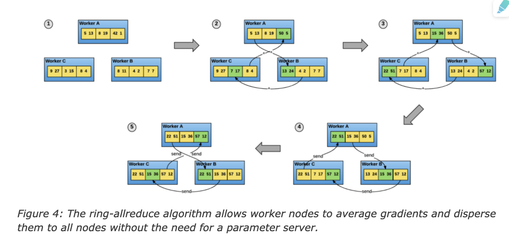

## Horovod: fast and easy distributed deep learning in TensorFlow
### why large-scale training?
- batter accuracy
	- single machine 에서 할 때에 batch size 를 크게 하는게 어려워짐 --> machine 을 여러개 써서, larget scale data 에 대해서도 batch norm 이 의미있게 만들겠다
- fast training
	- 당연한 얘기지만 속도
- 어느정도 성숙한 라이브러리엔 distributed 로 쓸 수 있게 하는 옵션이 있음(e.g. distributed tensorflow 등)
	- 근데 utilization 이 fully 되지는 못한다
- **distributed 하는 방식**
	- 일반적으로 model parallelism vs data parallelism
	- model parallelism : 모델을 쪼개서, 같은 데이터로 쪼개진 여러 모델에 학습 시킨 후 합침
		e.g. vgg16 에서 예시 확인 가능
	- data parallelism : 
		- gradient update 는 다 합쳐서 update 하는 것(이걸 따로 하면 분산이라기보단 앙상블이 돼버리는 것)
		- gradient update 전에 network 통신(gradient 를 평균으로 update)
		- 이 통신을 할때에 문제가 생기는 경우가 많아서 이 부분이 특히 개선돼야 함
		- distributed tensorflow 에서는 gradient를 worker 에서 server 에 전송해서 합치게 됨
			- 설정이 어렵고 속도가 느려짐
- Horovod 의 distributed training
	1. Master 가 parameter 초기화 후 worker 로 전달
	2. Worker는 모델을 가지고 있고 학습 데이터를 읽어서 Forward, Backward를 통해 최종적으로 모델 Update를 위한 Gradients를 계산
	3. 이 후 Gradients를 Ring-allreduce 방식으로 서로 주고 받고 각자의 Worker는 모아진 Gradients들의 평균을 이용하여 모델을 Update
	- (이렇게 worker들이 다 같은 Parameter 갖는 방식이 synchronous 방식)

	- ring-allreduce
	
		* ring 형태로 주고받고 나니 gradient가 전체에 전송되는데에 2(n-1)iteration 이면 된다.
	- tensor fusion
	- mpi 이용

## 참고 자료
- https://eng.uber.com/horovod/
- https://arxiv.org/abs/1802.05799
- https://y-rok.github.io/deep%20learning/2019/12/19/horovod-tensorflow.html
