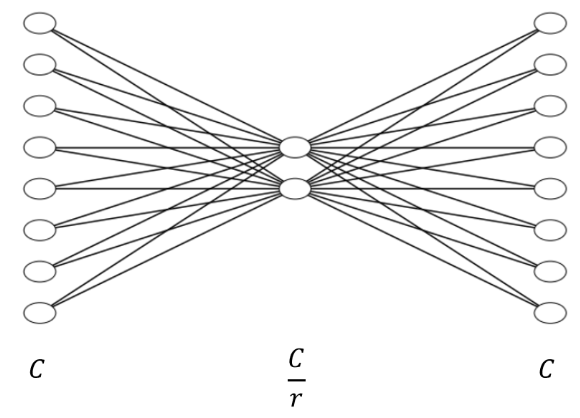
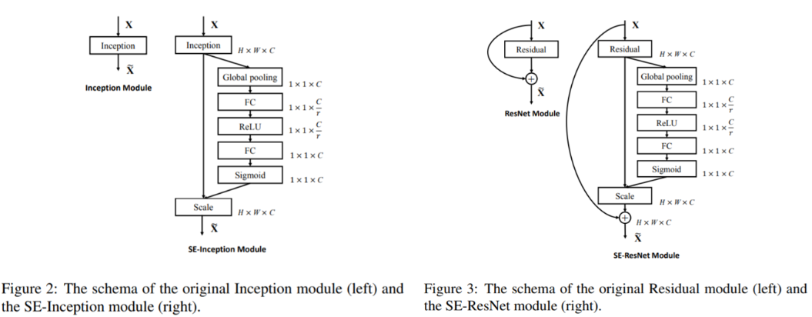

## cnn network with attention
### Spatial Transformer Network
1. Localisation net : input feature map U 에 적용할 transform 의 parameter matrix theta를 추정
2. Grid Generator : 추정한 theta 에 따라 input feature map 에서 sampling 할 지점의 위치를 정해주는 sampling grid T_theta(G)를 계산함
3. Sampler : sampling grid(T_theta(G))를 input feature map U 에 적용해서 변환된 output feature map V 를 만듬
https://jamiekang.github.io/2017/05/27/spatial-transformer-networks/
https://github.com/kevinzakka/spatial-transformer-network/blob/master/stn/transformer.py

### Residual attention network

### Sqeeze and excitation network
* recalibration 컨셉 활용
https://jayhey.github.io/deep%20learning/2018/07/18/SENet/
* explicitly, channel 과 convolution feature 간의 상호 의존관계를 모델링해서, representation power 를 높이기
* 장점
	* 네트워크 어떤 곳이라도 바로 붙일 수 있음(VGG, GoogLeNet, ResNet 등등)
	* parameter 증가량에 비해 성능향상이 매우 큼

1. squeeze operation
	* global information embedding
	* 각 feature map 에 대한 전체 정보를 요약(각 채널들의 중요한 정보만 추출해서 가져가겠다는 뜻)
	* GAP(Global Average Pooling)사용 - global spatial information 을 channel descriptor 로 압축
	* **수식을 쉽게 설명하자면 $H$, $W$, $C$ 크기의 피쳐맵들을 1, 1, $C$크기로 줄이는 것**
2. excitation operation
	* 각 feature map의 중요도를 scaling
	* 채널간 의존성(channel-wise dependencies)을 계산
	* fully connected layer, non-linear function 으로 이를 계산
	* reduction ratio 만큼 node 수를 줄였다가 다시 늘림
	
3. 이렇게 모든 함수를 거쳐서 나온 값을 가지고 기존 네트워크에 있던 GAP 이전의 $C$개의 피쳐맵에 각각 곱해줌
* 적용
	* 
	* https://github.com/taki0112/SENet-Tensorflow
```python
def Squeeze_excitation_layer(self, input_x, out_dim, ratio, layer_name):
    with tf.name_scope(layer_name) :
        squeeze = Global_Average_Pooling(input_x)

        excitation = Fully_connected(squeeze, units=out_dim / ratio, layer_name=layer_name+'_fully_connected1')
        excitation = Relu(excitation)
        excitation = Fully_connected(excitation, units=out_dim, layer_name=layer_name+'_fully_connected2')
        excitation = Sigmoid(excitation)

        excitation = tf.reshape(excitation, [-1,1,1,out_dim])

        scale = input_x * excitation

        return scale
```

### Bottleneck Attention Network
### convolutional block attention network