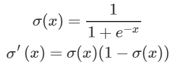
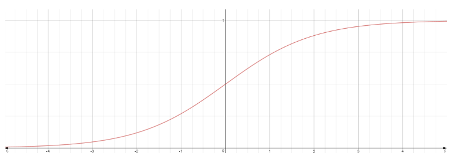
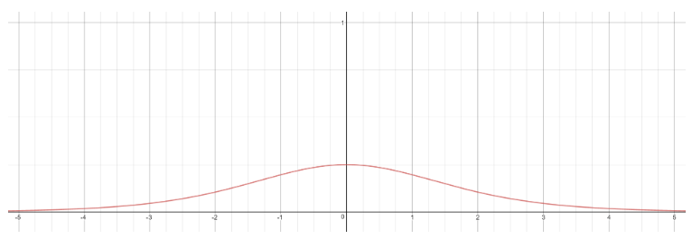
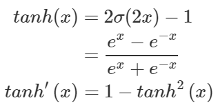
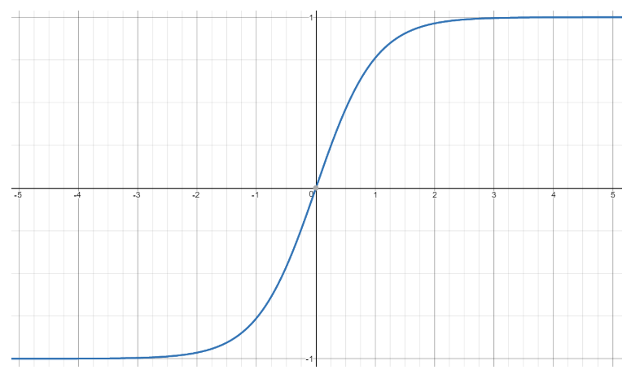
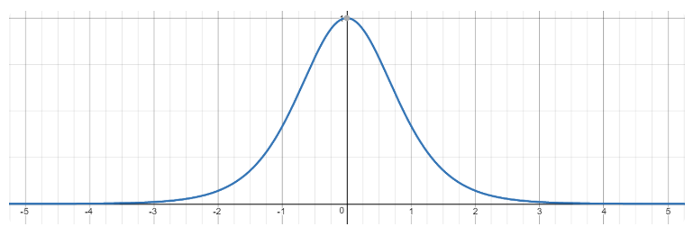

## Loss function / Activation function / Optimization function
### Loss function
- 최적의 매개변수 값을 탐색하는 하나의 지표
- e.g. rmse, cross entropy function
- 연속적인 부드러운 함수를 사용해야함
	- 매개 변수의 값이 조금 변하면 그에 반응해서 손실함수의 값도 연속적으로 변해줘야 학습이 잘 될 것이므로
	- 그래서 정확도 혹은 계단 함수 등을 바로 사용할수 없는 것

### activation function
* linearity 를 제거
1. sigmoid : 
	* sigmoid 함수(=로지스틱 함수)
		* 뉴런이 뱉어주는 값을 s 자 커브로 자연스럽게 활성화해줌
	
		* exp 연산이라 무거움 --> 학습이 느려짐
	* sigmoid 의 그래프
	
		* 값의 범위가 [0,1] --> 수렴 속도가 느려짐
	* sigmoid 1차미분 그래프
	
		* x 값이 크거나 작을 때에 gradient 값이 지나치게 작아짐 --> 학습이 잘 안됨
2. hyperbolic tangent(tanh)
	* sigmoid 의 크기와 위치를 조절한 함수
	
		* [-1, 1]
	* tanh 그래프
	
	* tanh 1차 미분 그래프
	
		* sigmoid 처럼 x 가 크거나 작아지면 gradient 가 0으로 작아짐
3. relu : 
	* f(x)=max(0,x)
	* 계산 복잡성이 낮음 --> sigmoid 나 tanh 대비 속도가 6배 빠름
	* 근데 0이하에서는 죽어버려서 이걸 써서 돌리면 10~20% 는 못쓰게 돼 버리는 것
3. leaky relu
	* f(x)=max(0.01x,x)
	* 죽지는 않아
4. parametric alpha - 이마저 학습하는 것

### optimization function
1. sgd
	- 단점
		* anisotropy 함수(방향에 따라서 기울기가 달라지는 함수. 즉 기울어진 방향이 본래의 최솟값과 다른 방향을 가리키는 경우)에서는 탐색경로가 비효율적 --> 지그재그로 전개함
2. sgd+momentum
	- momentum
		* 물리에서 공이 그릇의 곡면을 흐르듯 움직이게 하는 것 / 0.9(공기의 저항 혹은 마찰) \* 속도 - (learning rate)\*(손실함수 기울기)
		* 모멘텀의 갱신경로는 지그재그가 덜하게 움직임 - x 축의 힘은 아주 작지만 방향은 변하지 않아서 한 방향으로 일정하게 가속하기 때문. 반대로 y 축의 힘은 크지마 위 아래로 번갈아 받아서 상충하여 y 축 방향의 속도는 안정적이지 않음 / 전체적으로 x 축으로 빠르게 다가가게 되어 지그재그 움직임이 줄어든다
3. nestrove momentum
	* 실수할 가능성을 줄이기 위해 고안됨
	* velocity 방향으로 진행한 후 그 지점에서 gradient 를 구해서 그만큼을 더 가게 하는 방식
	* nestrove momentum 계산 복잡해져서 꼼수써 —> 즉석에서 계산하기 보다는 그 전 step 의 gradient 에 velocity 값을 넣어서 구한다.
4. adagrad
	* learning rate decay 를 일괄적용이 아니라 각각의 매개 변수에 '맞춤형' 값을 만들어주는 것
	* 매개변수의 원소 중 많이 움직인(크게 갱신된)원소는 학습률이 낮아지는 것
	* 근데 그래서 무한대로 더해나가니깐 멈춰버릴 수가 있다.
5. rms prob - adagrad 에 decay rate 적용
	* adaGrad 는 학습을 진행할수록 갱신 강도가 약해짐 / 무한히 계속 학습하면 어느순간 갱신량이 0이 되어 전혀 갱신되지 않게 됨
	* 과거의 모든 기울기를 균일하게 더해가는것이 아니라 먼 과거의 기울기는 서서히 잊고, 새로운 기울기 정보를 크게 반영함
	* (과거 기울기의 반영 규모를 기하급수적으로 감소시킴)
6. adam
	momentum + rms prob
	초기 값에 문제가 있을 거란 데서 시작(초기 값이 분모가 너무 작아서 값이 뛰어버리는 일을 예방하기 위해 beta 사용

참고 : https://ratsgo.github.io/deep%20learning/2017/04/22/NNtricks/
http://m.hanbit.co.kr/store/books/book_view.html?p_code=B8475831198
