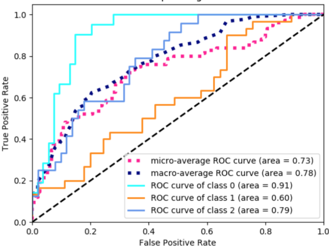

## 분류 모델에 쓸 수 있는 metric
### confusion matrix
|     | y^=1 | y^=0 |
|-----|------|------|
| y=1 | TP   | FN   |
| y=0 | FP   | TN   |
* accuracy
	* (true positive+ true nagative)/(전체 데이터(positive + negative))
* error rate
	* (false positive + false negative)/전체 데이터(positive + negative)
* recall
	* 진짜로 맞는것중에서 진짜 맞다고 한 비율
	* =sensitivitiy, true positive rate
	* (true positive)/(true positive + false negative)
* precision
	* 맞다고 한것중에서 진짜 맞는것의 비율
	* (true positive)/(true positive+false positive)
* specificity
	* negative 로 판단한 중 실제 false 인 비율
	* =true negative rate
	* (true negative)/(true negative + false positive)
* false positive rate
	* positive 인데 잘못해서 negative 로 판단
	* (false positive)/(false negative + true negative)

### F1 score
* F1 score
	* `2*(precision*recall)/(precision+recall)`
	* Precision 과 recall 을 한번에 나타내기 위해서
		* 두 수의 조화평균을 사용
		* 두 수보다 항상 작게 나온다
* F-beta score
	* precision 과 recall 의 조화 평균
	* `(1+b^2)*(precision*recall)/((b^2 * precision) +recall))`
	* Precision 이 중요하면 beta 를 작게(0.5), recall 이 중요하면 beta 를 크게(2) 설정
* 참고
	* (산술, 기하, 조화 평균)
		* 산술 -> 그냥 평균
		* 기하 -> 연평균 증가율
		* 조화 -> 평균 속력
	* type 1 error = false negative / type 2 error = false positive

### ROC curve (Receiver operating characteristic)
* 가로축을 false positive rate(1-specificity : specificity = (true negative)/(true negative + false positive))의 비율로 하고, 세로축을 true positive rate() 로 해서 시각화
* 1차원 공간에서 두 종류의 점을 가르는 지점으로 Split 
* 가능한 모든 split 을 생각해서 이 각각의 true positive rate, false positive rate 을 구함
* 보통의 형태

	- 그래프가 위로 뜰수록 더 잘 분류하는 모델인 것
* 그리고 이를 plane 에 plot 함
	* *AUC*(Area Under Curve) 이 plot 한 곳의 넓이
	(perfect split 이면 1(네모), random 은 0.5, good 은 0.8 정도)
	* 얼마나 잘 split 가능한지를 판별 --> 1에 가까울 수록 더 좋은 모델인 것
	* 0.5 이하인 경우 --> flipping 돼 있으면 0일 것

### precision recall plot
* 주로 데이터 라벨의 분포가 심하게 불균등할 때 사용함
(e.g. 98% vs 2%)
* x축 : recall / y축 : precision

## Regression model 에 쓸 수 있는 metric
* Mean absolute error --> 절대값은 미분이 불가능해서 gradient decent 등에서는 쓸 수가 없음
* Mean squared error --> error 를 제곱
* R2 score --> simplest possible model 과 비교해서 얼마나 다른가
	* Simplest possible model : 모든 점들을 평균내서 그은 선
	* (즉 현재 제작한 모델이 input에 따라서 output 이 얼마나 잘 변하는지 설명해주는 지표라고 볼 수 있음)
	* R2=1-(mse/simplest model 의 평균선)
		--> 이게 1에 가까울수록 좋은 모델 / 0에 가까울수록 안좋은 모델
