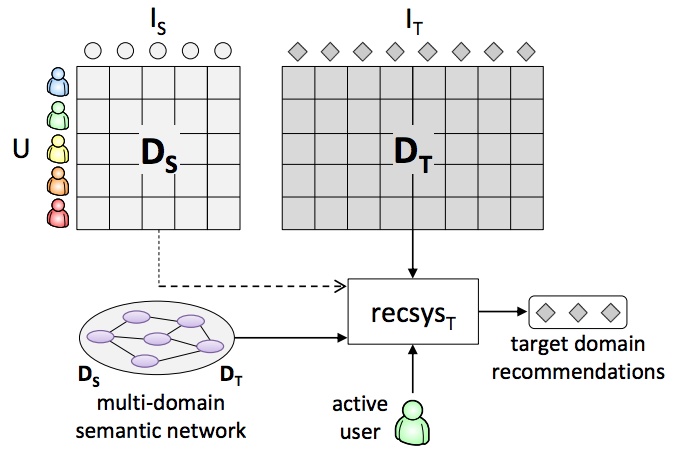
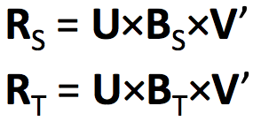
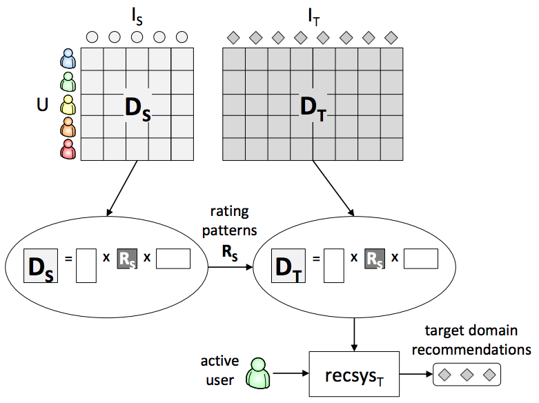
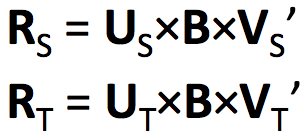
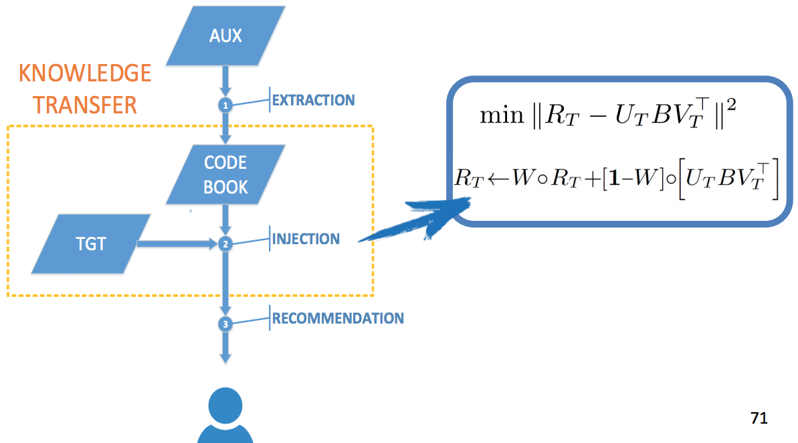

## cold start recommandation
* content / profile based methods
    * content: for new items
        * 음원 신호처리
        * (deep) collaborative topic regression
    * profile : for new users
        * DSSM
        * multi view DSSM
        * user linkage
* interview based methods
    * issue query(items) to a user
    * issue queries about a new item to users
    
* Definition of domain (domain levels)
	* attribute level(comedy <-> thriller)
		* same type of items, different values of certain attribute
	* type level (movies <-> books)
		* similar types, sharing some attributes
	* item level (movies <-> restaurants)
		* distinct types, differing in most, if not all attributes
	* system level (Netflix <-> movielens)
		* almost the same itmes, collected in different ways and/or from different operators
* cross-domain : opportunity or problem
	* source domain 이 bias가 되거나 noise 가 되거나
	 --> 근데 이건 weight 를 어떻게 주느냐에 대한 문제로 귀결됨
 	* two approaches
 			
 		* linking/aggregating knowledge
 			* user preferences merge 하기
 			* user modeling data 를 중재함
 			* recommendations 를 combine 함
 			* domain 을 link 함
 		* sharing/transferring knwledge
 			* latent feature 를 share 함
 			* rating pattern 을 변환함

## proposed categorization
* linking/aggregating knowledge
	1. merging single domain user preference
		* 제일 많이 쓰는 방법이고 제일 직접적임
		* 여러 domain 에서의 rating 정보로 user preference matrix 를 완성해감(user rating 을 single multi domain rating matrix로)
		* aggregate user preference
			* ratings, tags, transaction logs, click-through data
			* rating, tag, transaction log, click-through data 정보를 그대로 쓰는 것 / 다른 도메인 정보들을 그냥 붙여버려
			
			* pros
				* new-user problem 에는 좋아
				* robust
				* 설명이 용이함
			* cons
				* source 와 target domain 에 user-overlap 이 있어야돼 (social tag 나 semantic concept 로 구성된 user profile 을 이용하기도 --> 이 경우엔 user item 의 overlab 이 필요 없지(tag 나 semantic concept 이 common representation to merge user preferences from merge domain 으로 활용 될 수 있기 때문))
			* aggregate matrix 에는 single domain techniques 에 weight 를 주는 방식으로 해결할 수도 있어
				* ex
					* User-based kNN
						Berkovsky et al. 2007; Shapiraet al. 2013; --> rating correlation으로
						Winoto& Tang 2008; --> rating correlations and relations between domain categories
					* Graph-based
						Nakatsujiet al. 2010; Cremonesi et al. 2011; Tiroshiet al. 2013
					* Matrix Factorization / Factorization Machine
						Loni et al. 2014
	2. mediating user modeling data
		* 서로 다른 domain 에서의 모델(CF, CBF, Hybrid)을 aggregate 함
		* 유저간 유사성을 바탕으로 함
		
		* pros
			* new-user problem 에는 좋지
			* robust
		* cons
			* source 와 target 도메인에서 user 나 item 간의 overlap 이 필요함
		* ex
			* Aggregating collaborative or content similarities
				Berkovsky et al. 2007; Shapira et al. 2013; Shlomo
				Berkovsky, Tsvi Kuflik, and Francesco Ricci. 2008.
			* Aggregating user neighborhoods
				Berkovsky et al. 2007; Tiroshi & Kuflik 2012; Shapira et al. 2013
			* Aggregating latent features
				Low et al. 2011
	3. Combining recommendations
		* 각각의 domain 에서 recommendation model 적용 후 결과를 aggregate 하는 방식 (rating, ranking, probability distribution)
		
		* pros
			* 구현이 쉬움
			* 각 recommender 를 독립적으로 사용할 수 있음
			* 다양성이 증가함
			* context 에 independent 함
		* cons
			* user 간의 overlap 이 필요함
			* 각 domain 에서 나온 recommendation 에 대해서 weight tuning 이 어려울 수 있음
		* ex
			* Aggregating estimated values of ratings(blanding)
				Berkovsky et al. 2007; Givon & Lavrenko 2009
			* Combining estimations of rating distribution
				Zhuang et al. 2010
	4. Linking domains
		* 각 domain 들을 common 한 knowledge 로 연결시켜버림
			* item attributes, user attributes, association rules, semantic networks
			
			* ex
				* Overlap of user/item attributes
					Chung et al. 2007
				* Overlap of social tags
					Szomszor et al. 2008; Abel et al. 2011; Abel et al. 2013;
					Fernández-Tobias et al. 2013
				* Overlap of text (BoW)
					Berkovsky et al. 2006
					Semantic networks
					Loizou 2009; Fernández-Tobias et al. 2011; Kaminskas et al. 2013
				* Knowledge-based rules
					Azak et al. 2010; Cantador et al. 2013
	5. Sharing/transferring knowledge techniques - sharing latent features
		* shared latent features 로 source 나 target domain 연결
		
		* pros
			* source 와 target 모두에 대해서 sparsity 를 줄이고 accuracy 를 높일수있엉
		* cons
			* 계산이 복잡해
			* user 나 item 에 대해서 overlap 이 필요함
		* ex
			* tri-matrix co-factorization
				- user, item factor 가 shared 라고 보면, rating factor 만이 차이점이라고 볼 수있음 그래서 이걸로 factorization
				
				Pan et al. 2010 and 2011
			* tensor-based factorization --> domain as a context
				Hu et al. 2013
				
	6. Transferring rating patterns
		* rating pattern 을 domain간 transfer 할 수 있게 만들어
			
		* pros
			* user or item overlap 이 필요 없음
		* cons
			* 계산이 복잡함
		* ex
			* Code-Book_Transfer(CBT) : cluster level rating pattern 을 변환하는 것
				Li et al. 2009; Moreno et al. 2012; Gao et al. 2013
				
				
				1. auxiliary domain 에서 knowledge 추출
				2. sparsity 줄이기 위해 target domain 에 knowledge 주입
				3. user-based kNN 으로 target domain 에 대해 추천
			* Paolo Cremonesi and Massimo Quadrana. 2014. (Cross-domain recommendations without overlapping data: myth or reality?)

			
