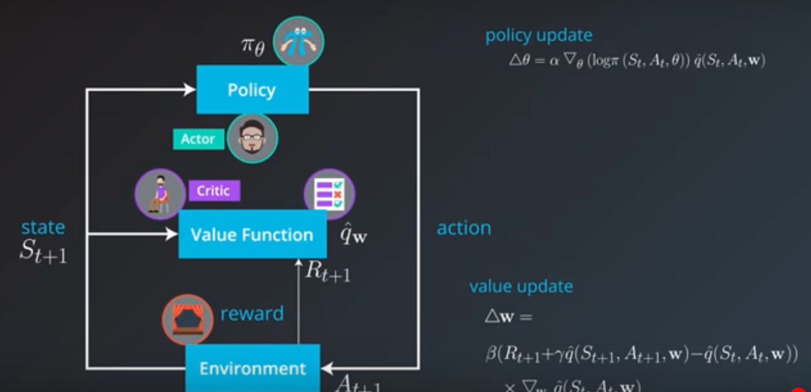

# Actor Critic method
* Reinforcement learning
	* Value-based methods
		* Monte carlo method
		* Q-learning
		* State 와 state action pair 로 나타내려 해
		* 여기서 가장 이득이 큰 state 로 이동하는 action 을 선택하게 돼
		* Finite number of action space 일 경우 유용함
	* Policy based methods
		* Value function으로의 변환이 아닌 policy 자체를 optimize 시키려고 해
		* Useful when the action space is continuous
		* Useful on stochastic policy
	* Actor critic method
		* Policy objective 를 reward 나 return 으로 계산하는 대신 state 나 state action value 를 직접 objective 계산에 쓴다면
		* actor 와 이를 보정하는 critic 을 따로 improve 해감
* Better score function
	* Episodic task 가 아닌 경우 어떤 순간에 policy 를 update 해야하는지 결정하고, environment 와 interaction 을 online 으로 하는 더 나은 score function 이 필요
	* 이를 위해 두개의 function 을 쓴다
* Two function approximations
	
	* Theta 는 그 action 을 선택할 확률
	* W 는 value Q hat of taking that action from that state (그 state 에서 그 action 을 택할 확률인 Q hat)
	* Policy update - actor
	* Value update - critic
	* 각각을 다른 neural net 을 태워서 learning 해
* The actor and The Critic
	* Actor, critic 각각을 learning 시키는 방법을 보자
	
	* Policy pie - theta 에 dependent
	* Value function q 는 w 에 dependent
	* State t 주어졌을 때에 policy 에 의한 어떤 action 을 취할 것(처음엔 random policy) 여기에 대해서 
	* 그러고나면 environment 는 다음 state s t+1 을 produce 할거고, 그에 따른 R_t+1 도 생성될 것
	* Critic 은 이거에 의한 value function q 를 계산할거고 actor 는 이 q value 를 가지고 policy 를 update 할거야
