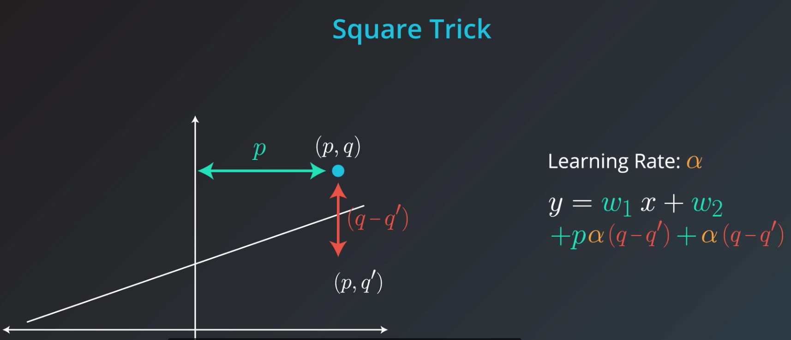
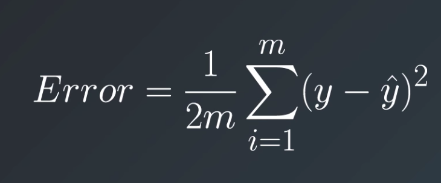
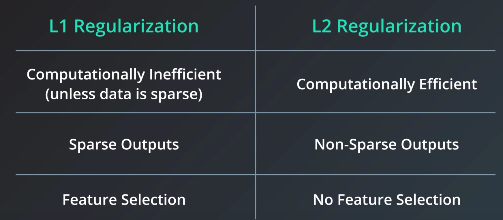

## Linear regression

* idea
```
Learning rate 에 따른 line parameter 변형 - 차이가 크다면 많이 움직이게 하고싶고, 차이가 적다면 적게 움직이게 하고 싶다
```

* Square trick

* Gradient descent
	* Error function
		* Mean absolute error
			* 각 x 좌표에서 예상 y 값과 실제 y 값의 차이의 절대값을 구하고 이들의 평균을 구해서 전체 error 구함
		* Mean squared error
			
			* 걍 편의상 1/2는 한거야(나중에 미분할거니깐 / 뭘 곱하던 상관이 없징)
	* Batch vs stochastic gradient descent
		* Batch gradient descent
			* 각 포인트마다에서 squared trick 적용해서 model 의 weight 변경
				* 한 포인트에서 적용하고, 그다음포인트에서 다시 적용하고
		* Stochastic gradient descent
			* 각 포인트에서 squared trick 적용하고 나온 결과들을 합해서 weight 를 update
		* 이 둘중에 ==> 둘다 데이터 많으면 시간 너무 많이 걸림
		* Mini batch gradient descent
			* 데이터들을 작은 단위로 split 하고(유사한 크기로), 각 batch 에서 weight를 update
	* Regularization
		* 복잡한 모델이 training data 엔 항상 더 잘 fit 할 수 있지
		* 근데 simplification 을 시킬 수가 없어
		* 그래서 각 변수의 계수들을 error 에 더해서 되도록이면 simple 한 model 이 선택되도록 해
		* L1 regularization
			* Error 에 coefficient 의 absolute value 더하기
			* 관련이 없는 weight 에 대해서는 0으로 만들어버리는 경향이 커서 feature selection 에 효과가 좋음
			* 대신 data 가 non-sparse 인 경우 계산이 비효율적일 수 있음
		* L2 regularization
			* Error 에 squares of coefficients 를 더해
		* Complicate model 에 대한 punishment 가 너무 클 수도 너무 작을 수도 있음
		* 위에서 정의한 값들에 람다를 곱해서, 때에따라 작을수도, 클 수도 있게
		* 어떨때 l1을, l2 를 쓰는가
		

			
				
			
				
				
