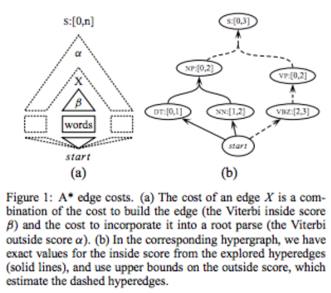
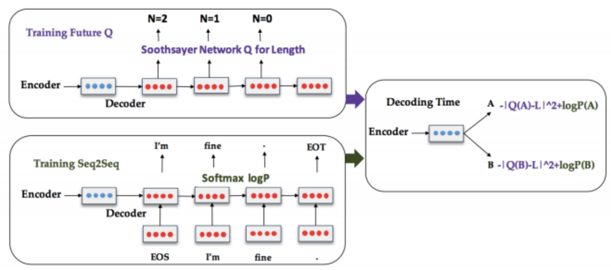

## Beam search
* Greedy 하게 top1 만 쓰지 않고, top k 를 활용
* At each time step
	* Expand each path
	* Choose top n paths from the expanded set

* ex>  Newyork, new jersey 가 후보라면 뒤에 cranberry 가 나올경우는 newyork 보다는 new jersey 일거야
* Potential problems
	* Action set 이 unbalanced (tree 가) 
	* Beam size 제한을 해도, 길이가 늘어나면 엄청나게 느려져(특히 beam 이 커지면 엄청 느려져)
	* Diversity 가 부족함
		* 초기 단계에 선택된 단어들이 
	* Metric 관점
		* 매 순간 계산되는 score 들이 당연히 계속 length 가 길어지면 loss function 이 자꾸 덧붙여지니깐 자꾸 커질수밖에 없어서
		* 짧은 길이만 선호하게 될거야
	* Dealing with disparity in actions Effective Inference for Generative Neural Parsing (Mitchell Stern et al., 2017)
		* In generative parsing there are Shifts (or Generates) equal to the vocabulary size 
* Solution
	* Fast tracking:  To further reduce comparison bias, certain Shifts are immediately added to the next bucket
		* 빈번하게 일어나는 shift 를 하나 더 넣은 것(?)
	* Pruning
		* Expand 하다가 영 아닌 것 같으면 그만 가고 잘라내버린다는 것
		* Pruning the search tree speeds things up
			* Remove paths from the tree
			* Predict what paths to expand - 어떤걸 expand 할지 predict 해서 함
		□ Threshold based pruning ‘Google’s Neural Machine Translation System: Bridging the Gap between Human and Machine Translation’ (Y Wu et al. 2016)
			* Compare the path score with best path score
				* Beam size 를 맞추지 못하지는 않을까 하는 걱정이 있지만 그 다음 depth 로 가면 자연스럽게 beam size 보다 큰 후보군을 만날 수 있어서 전혀 문제가 없어
			* Compare expanded node score with best node
				* If either falls beneath threshold, drop them
		* Predict what nodes to expand
			* 어떤 node 를 expand 할지 학습
			* Effective Inference for Generative Neural Parsing (Stern et al., 2017)
				
			@-@ 놓침
		 
	* Improving Diversity in top N Choices Mutual Information and Diverse Decoding Improve Neural Machine Translation (Li et al., 2016)
		□ 
		* 누군가의 자식이 균일하게 선택되게 하기 위해서 첫째에겐 loss1, 둘째에겐 loss2를 무조건 줘버린다
	* Sampling 해서 sequence 를 구성해버리겠다
		* Translation 에 비해서 conversation 은 다양한게 나올 수 있게 될거라서 sampling 해서 사용하는게 의미가 있어
	* Variable length output sequences
		* Beam search는 length 짧은걸 선호하니깐, length 로 normalize 해서 사용
	* More complicated normalization
		□ 
		* Alpha등의 term 을 둬서 flexibility를 준다
	* Predict the output length Tree-to-Sequence Attentional Neural Machine Translation (Eriguchi et al. 2016)
		□ 
		* Translate 하는데, 이정도 길이가 달라지더라 라는게 이미 있을 수 있으니 여기에 따라서 score 를 깎아버려
	* What beam size should I use?
		* 경험적인 것
		* Many papers use less than 15, but I’ve seen as high as 1000
	* Beam Search-Benefits and Drawbacks
		* Benefits: 
			* 구현이 쉬워용
			* Model score 가 작아지는 경우가 없어(무조건 좋아져)
		* Drawbacks
			* Beam size 가 커지면 느려짐
			* Bleu score 와 일치하지 않기 때문에 항상 점수를 높여주니는 않아
* Using beam search in training
	* Sequence-to-Sequence Learning as Beam-Search Optimization (Wiseman et al., 2016)
	* Beam search 를 학습에 쓴대
	* Decoding with beam search has biases
		* Exposure: Model not exposed to errors during training
		* Label: scores are locally normalized 
	* More beam search in training A Continuous Relaxation of Beam Search for End-to-end Training of Neural Sequence Models (Goyal et al., 2017)
		* 그냥 뉴럴 넷 넣어버리는 것
		□ 

## A* algorithm
* A* search
	* Iteratively expand paths that have the cheapest total cost along the path
	* total cost = cost to current point + estimated cost to goal
	* f(n) = g(n) + h(n) 
		* g(n): cost to current point 
		* h(n): estimated cost to goal
		* h should be admissible and consistent
* Classical A* parsing A* Parsing: Fast Exact Viterbi Parse Selection (Klein et al., 2003)
	* PCFG parsing 에 잘 working 한대(exact 니깐)
		
	* Estimating future costsLearning to Decode for Future Success (Li et al., 2017)
		
		* 아마도 따로 학습했을 듯
	* Benefits:
		* With heuristic, has nice optimality guarantees
		* Strong results in CCG parsing
	* Drawbacks:
		* Needs more construction than beam search, can’t easily throw on existing model
		* Requires a good heuristic for optimality guarantees --> 휴리스틱 찾기가 짱 어려워

## Other search algorithms
* Particle Filters A Bayesian Model for Generative Transition-based Dependency Parsing (Buys et al., 2015)
	* Reranking
		* Recurrent Neural Network Grammars (Dyer et al. 2016)
		* 여러 모델 reranking
			* Ex) translate model A 가 있고, beam search 가 beam size 만큼 나오고 나면, 그 뒤에 language model 같은거 붙여서 어떤게 더 높은 점수 받는지를 놓는다
	* Monte-Carlo Tree Search 
			§ 열심히 sampling 해서 탐색한다
