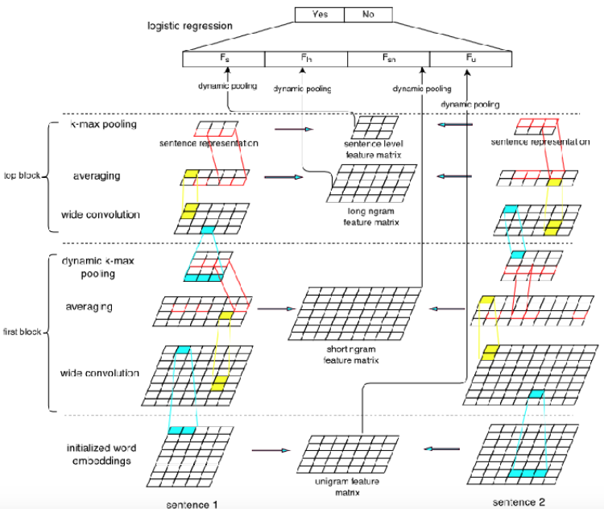

## sentence representation
* 문장을 vector 로
	
	1. 문장 전체를 1차원 벡터(3\*1)로 만들거나
	2. 아니면 단어 하나씩에대해서 vector 하나로 놓고, 그 네개 단어를 붙여서 다차원 벡터를 만들거나(3\*4) --> attention 계열이 이쪽을 활용한 것
* 활용
	* IR(검색) 쪽에서는 특히...
	* sentence classification / paraphrase identification / semantic similarity / entailment / retrieval

### Sentence Classification
* topic, sentiment, subjectivity/objectivity 등등 여러가지로 분류해둬
	
	embedding 붙여서 cnn or rnn 후 softmax --> prob 계산

#### Paraphrase Identification
* A 문장과 B 문장이 주어졌을 때에 이 두 문장의 의미가 같은지 다른지를 예측
	* '완전히 같다'의 정확한 정의에 대해서는 의견이 분분함
* 데이터 예시
	* Microsoft Research Paraphrase Corpus (Dolan and Brockett 2005) 
		* news corpus 를 다 모은다음에 비슷해 보이는걸 분리함
		--> 5800 sentences (질은 좋은데 양이 적엉)

* 모델1 - sentence 를 vector 로 나타내고 이 둘사이의 similarity 를 계산(두 문장이 같다 틀리다)하는 classifier(logistic regression or NN or jaccard 등 여러가지)로 돌려
	
	1. Skip-thought Vectors (Kiros et al. 2015)
		* word to vec 의 sentence 버전
			* google 논문
			* general method
		* unsupervised training : large scale data로 주변 문장들 학습 (Using encoder-decoder)
		  --> 주변에 나왔으면 비슷한 문장일것이다 라는 가정으로
		
			그림에서
				좌측의 문장과 거기서 나온 sentence vector
				좌측의 문장을 돌렸을 때에 이전문장(그림의 우측 상단)과 이후문장(그림의 우측 하단)을 잘 예측할 수 있는 모델로 구성
		* full text 형태의 task 에 잘 working 할 것 (domain 에 따라 working 할수도, 하지 않을수도)
* 모델2 - multiple-vector representation(단어 하나하나마다 vector 1차원으로 해서 문장 하나는 다차원 vector) 을 계산해서 1번과 비슷한 결정을 함
	
	1.  Convolutional Features + Matrix-based Pooling (Yin and Schutze 2015)
		
		1. convolution 해가면서 압축
		2. 위에서 두번째 벡터는 1번문장에서 온 벡터 + 두 문장의 상호관계에서 온 두개의 벡터 + 2번 문장에서 온 벡터
		3. 맨 위에서는 이 벡터들 합쳐서 logistic regression
	2. Paraphrase Detection w/ Discriminative Embeddings (Ji and Eisenstein 2013)
		* word/context vector 에 대해 matrix factorization
		(딥러닝 보다, mf 같은 방법론이 여전히 유효하다! 라는 의미에서 --> 의외로 paraphrasing 에서는 지금도 mf 방법론의 성능이 제일 좋대- 위에서 나왔던 MSRPC 데이터에대해 적용해보면 이게 제일 좋대)
		* word vs context 의 matrix 가 있을 때에 이걸 mf 하고나면 context를 모르던 word 들에 대해서도 채워질 것
		* 이를 다시 kl-divergence 로
		
		우측 상위로 갈수록 비슷한 단어 / 좌측 하단으로 갈 수록 안비슷한 단어

